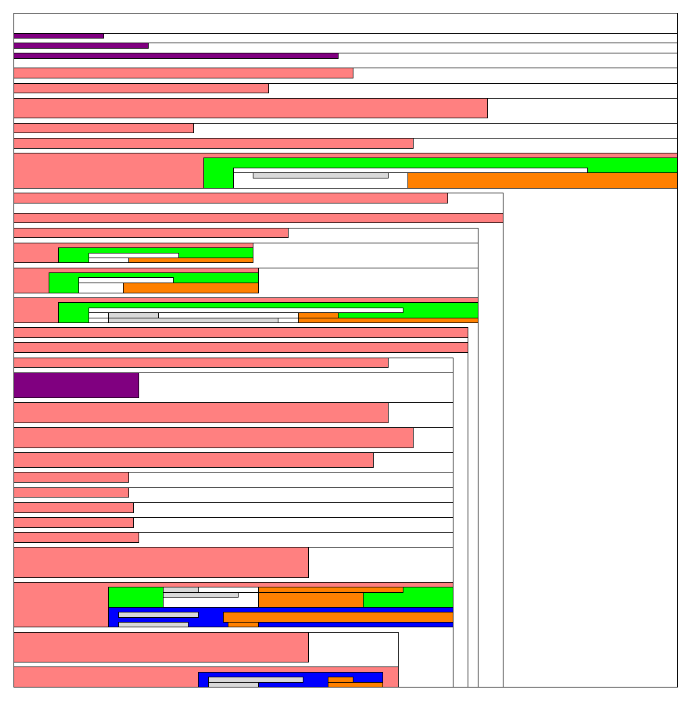
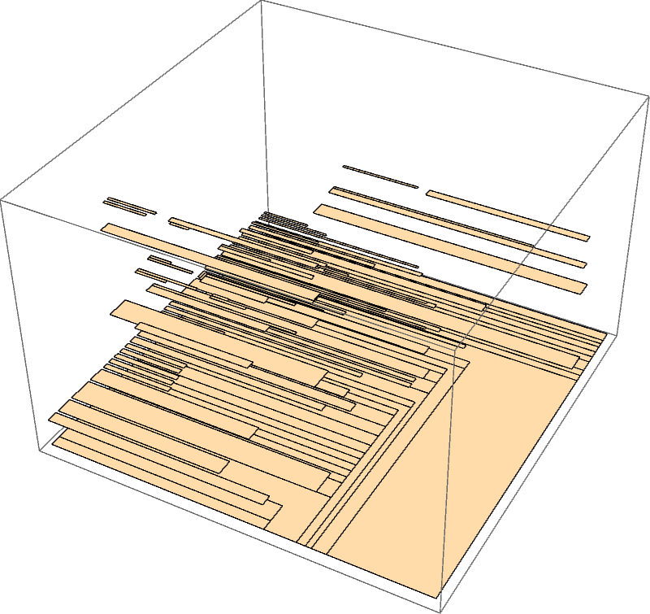

## Introduction

This repository contains assorted demonstration code in my
‘flagship’ programming languages—Motmot and Tanager.

Because many people are unaware, both languages are named
for neoTropical songbirds: This is a turquoise-browed motmot
(_Eumomota superciliosa_):

… and this is a green-headed tanager (_Tangara seledon_):

Motmot began in 2015, although its implementation started
much later; Tanager has been under development, in one form
or another, since 2009 and is currently in maintenance mode.
Both are functional languages drawing inspiration,
variously, from Haskell, Miranda, Hope, F#, Scala, (my
language) Sisserou, and Wolfram, inter alia. Both languages'
implementations are proprietary and are not available for
anyone's use other than mine.

## Motmot Highlights

* [Text Processing
  Demonstration](text-processing/README.md): Demonstration
  of Motmot's text-processing library.

* [Testing in Motmot](TestingInMotmot.ipynb): Illustration
  of two styles of test cases in Motmot: Hand-written cases
  and [QuickCheck](https://en.wikipedia.org/wiki/QuickCheck)
  properties.

* [ParserCombinators.mot](ParserCombinators.mot):
  ‘Motmot-A’-syntax (This is a simple, one-dimensional
  syntax, like that found in most programming languages.) of
  Graham Hutton's seminal parser-combinator paper, along
  with some comments comparing the Miranda implementation
  from that paper.

* [ParserCombinators.d.mot](ParserCombinators.d.mot):
  ‘Motmot-D’-syntax (This is a CamlTrax-inspired
  indentation-sensitive variation of the ‘Motmot-A’ syntax
  which allows omitting numerous ‘administrative’ tokens and
  bracketing to establish the nesting of control
  structures.)

* [ParserCombinators.b.mot](ParserCombinators.b.mot):
  ‘Motmot-B’-syntax (This is block-based, two-dimensional
  syntax, like Tanager's.) version of the same code.

  * ‘B’ syntax is deprecated; this will probably be removed
    in the future.

  * Here is a visualisation of the recursive space
    partitioning used to parse Motmot B (and Tanager);
    colours represent the various classes of syntactic
    structure:
    

  * Here is a 3-D visualisation of the same parse, with
    Z-values corresponding to recursion depth:
    

* [PolymorphicRecursion.b.mot](PolymorphicRecursion.b.mot):
  ‘Motmot-B’-syntax examples of polymorphic recursion based
  on Hallett and Kfoury's paper on the topic.

* [SieveOfEratosthenes.mot](SieveOfEratosthenes.mot):
  Generate primes; based on some more code by Hutton,
  demonstrating ‘Why Functional Programming Matters’-style
  manipulation of (potentially-)infinite data structures.

## Tanager Highlights

* [Factorial.t5](Factorial.t5): Numerous factorial
  implementations, demonstrating the language's syntactic
  versatility, ranging from a mutable-reference-based
  version, to a point-free one, to Peano arithmetic, along
  with some tests.

* [FizzBuzz.t5](FizzBuzz.t5): A few implementations of the
  fizz–buzz problem, demonstrating: Predicate patterns,
  `cases` discrimination, absurd patterns, list ranges,
  tuple catamorphisms, expression infixation, and generative
  tuple projection.

* [Mandelbrot.t5](Mandelbrot.t5): Simple text renderer of
  the Mandelbrot Set, demonstrating: Records and recursive
  λs.

* [Sudoku.t5](Sudoku.t5): A nondeterminism-monad-based
  (i.e., backtracking) Sudoku solver, demonstrating:
  Algebraic data types, list comprehensions, pipeline
  composition, and mixfix syntax.

## The Rosetta Stone

If you have a wide monitor (or are unafraid of tiny text),
have a look at (now-autogenerated!)
[The Rosetta Stone](RosettaStone.txt) … Rather than a
tedious proclamation about tax exemptions for priests, it's
matched Tanager, Motmot-B, and Motmot-D code implementing a
classic parser-combinator library, along with commentary.
